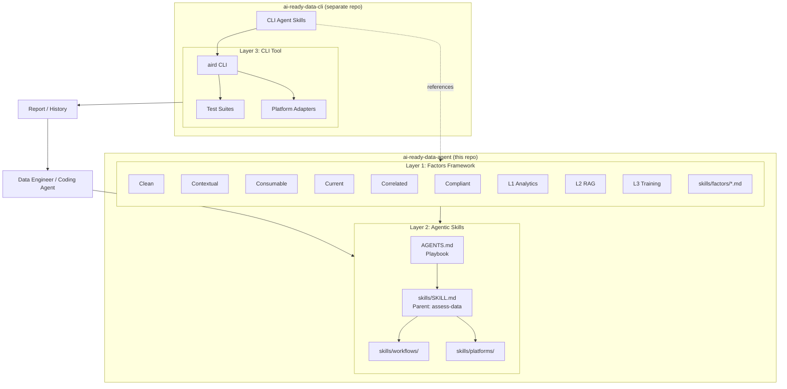
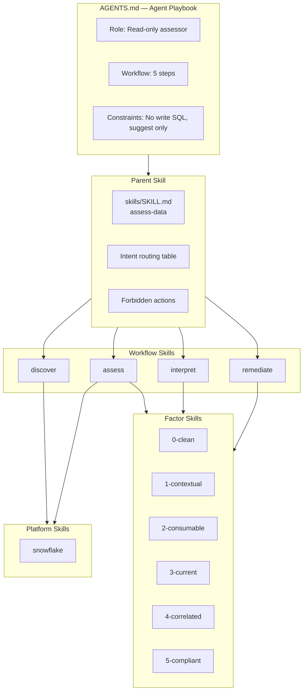
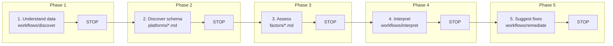
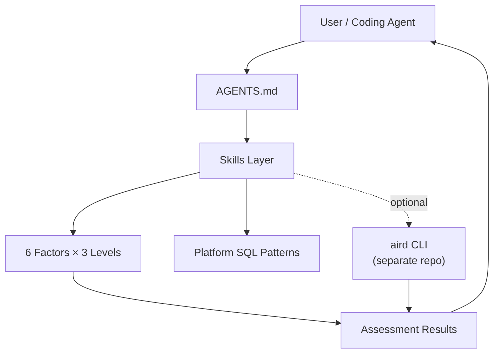

# AI-Ready Data Assessment — System Map

A conceptual map of the entire system: framework, agent playbook, skills, and how they relate to the CLI (in the separate [ai-ready-data-cli](https://github.com/ai-ready-data/ai-ready-data-cli) repo).

---

## 1. High-Level Architecture (Two Repos)

---

## 2. Agent Playbook & Skills Hierarchy

---

## 3. Workflow & Stopping Points

---

## 4. Full System Overview (Compact)

---

## Key Files Reference

| Component | Location |
|-----------|----------|
| Playbook | `AGENTS.md` |
| Parent skill | `skills/SKILL.md` |
| Workflow skills | `skills/workflows/{discover,assess,interpret,remediate}.md` |
| Factor skills | `skills/factors/{0-clean,1-contextual,2-consumable,3-current,4-correlated,5-compliant}.md` |
| Platform skills | `skills/platforms/snowflake.md` |
| Audit skill | `skills/audit/SKILL.md` |
| CLI tool | [ai-ready-data-cli](https://github.com/ai-ready-data/ai-ready-data-cli) repo |
