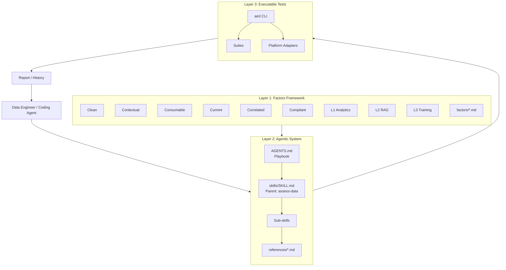
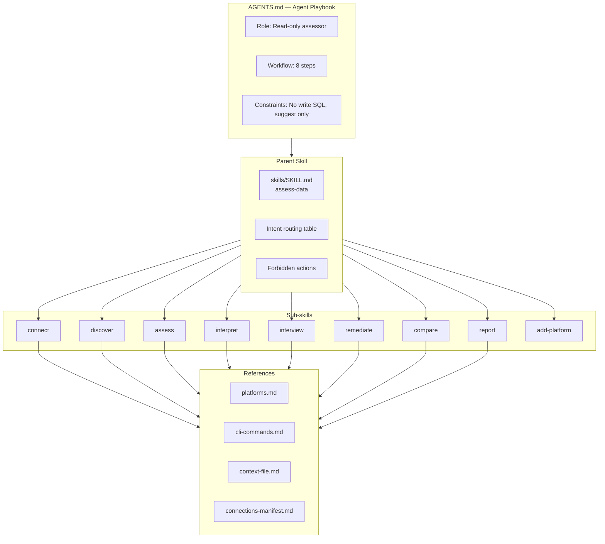
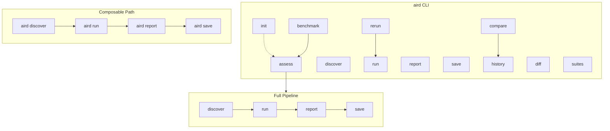
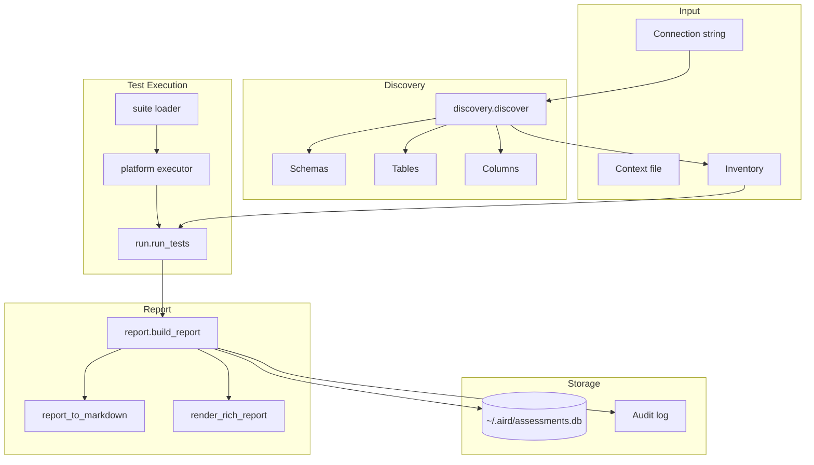
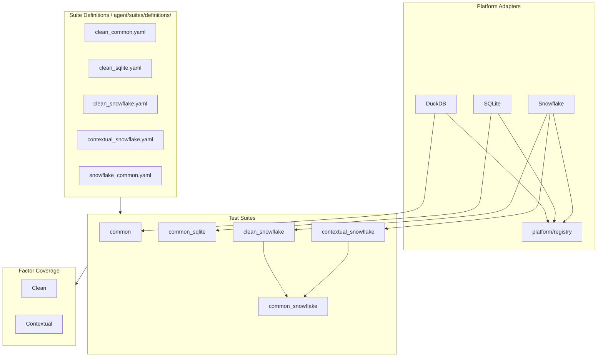
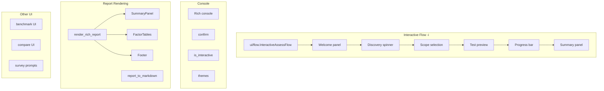
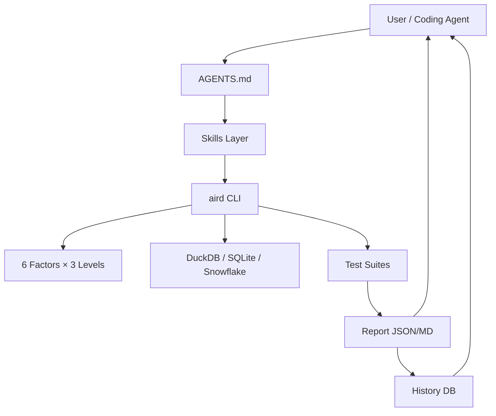

# AI-Ready Data Assessment — System Map

A conceptual map of the entire system: framework, agent playbook, skills, CLI, and components.

---

## 1. High-Level Architecture (Three Layers)

---

## 2. Agent Playbook & Skills Hierarchy

---

## 3. Workflow & Stopping Points

```mermaid
flowchart LR
  subgraph Phase1 [Phase 1]
    I1[1. Understand data<br/>interview/SKILL]
    I1 --> STOP1
    STOP1[STOP]
  end

  subgraph Phase2 [Phase 2]
    C[2. Connect<br/>connect/SKILL]
    D[3. Discover & scope<br/>discover/SKILL]
    STOP2[STOP]
    C --> D --> STOP2
  end

  subgraph Phase3 [Phase 3]
    A[4. Assess<br/>assess/SKILL]
    STOP3[STOP]
    A --> STOP3
  end

  subgraph Phase4 [Phase 4]
    IN[5. Interpret<br/>interpret/SKILL]
    STOP4[STOP]
    IN --> STOP4
  end

  subgraph Phase5 [Phase 5]
    REM[6. Suggest fixes<br/>remediate/SKILL]
    STOP5[STOP]
    REM --> STOP5
  end

  subgraph Phase6 [Phase 6 Optional]
    COMP[7. Compare<br/>compare/SKILL]
    BENCH[8. Benchmark]
  end

  STOP1 --> C
  STOP2 --> A
  STOP3 --> IN
  STOP4 --> REM
  STOP5 --> COMP
  COMP --> BENCH
```

---

## 4. CLI Commands & Pipeline

---

## 5. Assessment Pipeline Internals

---

## 6. Platform & Suite Architecture

---

## 7. UI Components

---

## 8. Full System Overview (Compact)

---

## Key Files Reference

| Component | Location |
|-----------|----------|
| Playbook | `AGENTS.md` |
| Parent skill | `skills/SKILL.md` |
| Sub-skills | `skills/workflows/{discover,assess,interpret,remediate}.md`, `skills/cli/{connect,discover,assess,interpret,remediate,compare}.md` |
| References | `skills/cli/references/{platforms,cli-commands,context-file,connections-manifest}.md` |
| Factors | `skills/factors/0-clean.md`, `1-contextual.md`, `2-consumable.md`, `3-current.md`, `4-correlated.md`, `5-compliant.md` |
| CLI entry | `agent/cli.py` |
| Pipeline | `agent/pipeline.py` |
| Suites | `agent/suites/definitions/*.yaml` |
| UI flow | `agent/ui/flow.py` |
| Rich report | `agent/ui/report.py` |
