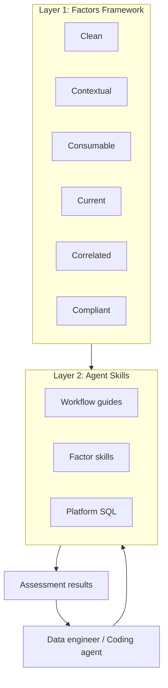

# AI-Ready Data Framework: Project Specification

High-level project specification for the AI-Ready Data Framework. This document defines purpose, target user, the design layers, principles, repository layout, and community. It is written to stand alone.

> **Note:** The `aird` CLI tool (test execution, reporting, storage) lives in the separate [ai-ready-data-cli](https://github.com/ai-ready-data/ai-ready-data-cli) repository.

---

## 1. Purpose and scope

**Purpose:** Define a specification-driven framework that assesses data platforms and data assets for AI-readiness. The system comprises:

1. The factors of AI-ready data as a conceptual framework
2. Portable agent skills that guide assessment, interpretation, and remediation
3. Platform-specific SQL patterns and workflows

**Key terms:** *AI-ready data* — data that meets the factors for the workload (use case) you target. *Data asset* — a concrete object of assessment (e.g. schema, table, column). *Workloads* — three use cases: descriptive analytics/BI (L1), RAG/retrieval (L2), ML training/fine-tuning (L3); ordered by strictness of requirements (not maturity); requirements are additive. *Factor* — one of six categories: Clean, Contextual, Consumable, Current, Correlated, Compliant. *Data layer* — everything outside the AI system boundary (ingestion, transformation, storage, serving); its job is to ensure what crosses into the model is fit for consumption. Full definitions: [definitions.md](../definitions.md).

**Scope:**

- **In scope:** Factors framework (definitions, rationale, requirements by workload level); agentic skills (assessment SQL, thresholds, remediation patterns, workflow guides); platform SQL patterns; documentation and reasoning.
- **Out of scope:** CLI implementation (see the ai-ready-data-cli repo); implementation of every possible data platform; specific UI.

**Non-goals:** This system is not for real-time monitoring, not a replacement for a data catalog, and not a general data quality engine. It is an assessment and guidance framework.

---

## 2. Target user and success criteria

**Primary user:** A data engineer or data architect who has credentials and experience with their data. Their goal is to assess their system for AI-readiness based on the factors of AI-ready data.

**Secondary users:** Data leaders (assessing organizational readiness), platform teams (designing for ML/AI workloads), ML practitioners (evaluating whether the stack supports their use case), and coding agents (automating assessment workflows).

**Coding agent environment:** The skills are designed for any agent that can read Markdown and execute SQL (e.g. Cursor, Windsurf, Claude Code, Cortex Code). No CLI or Python installation required for the portable skills. Credentials and connection details are supplied by the user or via environment, not discovered by the agent from the repo.

**Outcomes:** The framework enables:

- **Assessment** against six factors at three workload levels (L1/L2/L3)
- **Interpretation** of results with factor-specific context and scoring rules
- **Remediation suggestions** (actionable fixes for failures; user reviews and executes)
- **Platform-specific guidance** for discovery and assessment SQL

---

## 3. The two layers



### Layer 1 — Factors of AI-ready data

**Role:** Six categories that define what "AI-ready" means for each workload level: Analytics (L1), RAG (L2), Training (L3).

Each factor includes requirements with numeric thresholds per workload level, assessment SQL, interpretation rules, remediation patterns, and stack capabilities. The factor skills in `skills/factors/` are the single source of truth.

### Layer 2 — Agent skills

**Role:** Portable, agent-agnostic guidance for assessment workflows.

- **Factor skills** (`skills/factors/`) — Requirements, thresholds, assessment SQL, interpretation, and remediation for each factor.
- **Workflow skills** (`skills/workflows/`) — Step-by-step guides: discover, assess, interpret, remediate.
- **Platform skills** (`skills/platforms/`) — Platform-specific SQL patterns and connection details.
- **Audit skill** (`skills/audit/`) — Optional audit logging to a local SQLite database.
- **AGENTS.md** — Playbook for coding agents: workflow, stopping points, constraints.

Skills are markdown files. No separate runtime or interpreter is required. Any agent that can read markdown and execute SQL can perform assessments.

---

## 4. Design principles and constraints

- **Read-only:** Assessments never create, modify, or delete user data.
- **Specification-first:** Each layer is designed and documented with reasoning; implementation follows the specs.
- **Agent- and human-usable:** Skills are usable by both coding agents and humans, with clear entry points and stopping points.
- **No installation required:** The portable skills require no CLI, no Python, no package install. Any agent with SQL access can assess data.
- **Remediation is suggest-only:** Factor skills include remediation patterns. The agent presents suggestions; the user reviews and executes. The agent never executes remediation.

---

## 5. Repository layout

```
README.md                    # Framework overview
AGENTS.md                    # Agent playbook
CONTRIBUTING.md              # Contribution guide
skills/
  SKILL.md                   # Universal entry point
  README.md                  # Architecture explanation
  factors/                   # Factor definitions, thresholds, SQL, remediation
  platforms/                 # Platform-specific SQL patterns
  workflows/                 # Step-by-step workflow guides
  audit/                     # Optional audit logging skill
docs/
  definitions.md             # Canonical definitions
  specs/                     # Specifications
  designs/                   # Design rationale
  log/                       # Decision log
```

**Key entry points:**

1. **For agents:** Start at `AGENTS.md`, then `skills/SKILL.md`.
2. **For humans:** Start at `README.md`, then `skills/factors/README.md` for the threshold quick reference.
3. **Specs and reasoning:** Under `docs/specs/` and `docs/designs/`.

---

## 6. Documentation roadmap

- **project-spec.md (this document):** High-level project specification.
- **[factor-spec.md](factor-spec.md):** Abstract shape of a factor; requirement keys; mapping to remediation.
- **[agentic-system-spec.md](agentic-system-spec.md):** Agent/skills architecture, AGENTS.md, skill model.
- **Design decisions:** Recorded in `docs/designs/` and `docs/log/`.

---

## 7. Community

**Community contribution:** New platforms can be added by creating a platform skill in `skills/platforms/`. Factor SQL uses standard placeholders (`{schema}`, `{table}`, `{column}`); contributors verify their platform's SQL dialect compatibility and document differences.

For CLI contributions (platform adapters, test suites, commands), see the [ai-ready-data-cli](https://github.com/ai-ready-data/ai-ready-data-cli) repo.
