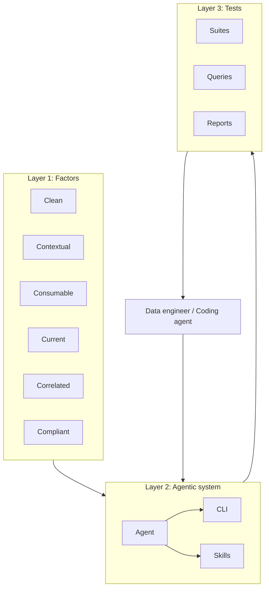

# AI-Ready Data Agent: Project Specification

High-level project specification for the AI-Ready Data Agent. This document defines purpose, target user, the three design layers, principles, repository layout, documentation roadmap, and community. It is written to stand alone: no dependency on other repos or folder names.

---

## 1. Purpose and scope

**Purpose:** Define a specification-driven system that assesses data platforms and data assets for AI-readiness. Design is guided by first-principles thinking where useful; we do not use "first principles" as a formal phase or gate. The system comprises:

1. The factors of AI-ready data as a conceptual framework
2. An agentic layer (agent + skills + CLI) that orchestrates assessment and user interaction
3. An extensible suite of executable tests run against data platforms and assets

**Definitions:** Canonical definitions live in `docs/specs/definitions.md`. The framework README summarizes them.

**Key terms:** *AI-ready data* — data that meets the factors for the workload (use case) you target. *Data asset* — a concrete object of assessment (e.g. schema, table, column). *Workloads* — three use cases: descriptive analytics/BI (L1), RAG/retrieval (L2), ML training/fine-tuning (L3); in tables and config we use the short names L1/L2/L3, ordered by strictness of requirements (not maturity); requirements are additive. *Factor* — one of six categories: Clean, Contextual, Consumable, Current, Correlated, Compliant. *Data layer* — everything outside the AI system boundary (ingestion, transformation, storage, serving); its job is to ensure what crosses into the model is fit for consumption. Full definitions: `docs/specs/definitions.md`.

**Data layer:** The AI system is the model and its inference layer. Everything outside that boundary is the **data layer**. The data layer's job is to ensure that what crosses the boundary is fit for consumption. Assessment evaluates the data layer against the factors; it does not evaluate the model.

**Scope:**

- **In scope:** Factors framework (definitions, rationale, requirements by workload level); agentic system design (agent responsibilities, skills, CLI); test suite design (model, platforms, extensibility); documentation and reasoning for all of the above; concrete outcomes (see Outcomes below).
- **Out of scope:** Implementation of every possible data platform, save for community contribution; specific UI beyond the CLI.

**Non-goals:** This system is not for real-time monitoring, not a replacement for a data catalog (e.g. Alation, Collibra, DataHub), and not a general data quality engine. It is an assessment and guidance tool.

---

## 2. Target user and success criteria

**Primary user:** A data engineer or data architect who has credentials and experience with their data. Their goal is to assess their system or subsets of their system for AI-readiness based on the factors of AI-ready data.

**Secondary users:** Data leaders (assessing organizational readiness), platform teams (designing for ML/AI workloads), and ML practitioners (evaluating whether the stack supports their use case) may use or commission assessments; the primary user is the one running the tool and interpreting results.

**Onboarding criteria:** A user can point their coding agent at this repo, install all required packages, and load the skills/agent into the environment to begin the assessment process without prior deep knowledge of the codebase.

**Coding agent environment:** The CLI and skills are designed for any environment that can read Markdown and run a shell/CLI (e.g. Cursor, Windsurf, Claude Code). We document and test for agent usability; we do not lock to a single vendor. Credentials and connection details are supplied by the user or via environment/connection string, not discovered by the agent from the repo.

**Outcomes:** The system produces concrete outputs:

- **Test results** in JSON (per-run results, factor/requirement/target, pass/fail per workload L1/L2/L3)
- **Report** in Markdown (human-readable summary, scores, failures)
- **Scores by factor and workload** (L1/L2/L3 readiness per factor)
- **Remediation suggestions** (actionable fixes for failures; user reviews and executes — the agent never runs remediation)
- **History and diffing** via a SQLite interface (stored assessments, compare runs)
- **Optional audit log** (behind a flag): when enabled, the same SQLite DB stores a full audit of all queries run and all conversation with the user; no retention or size limit for now

---

## 3. The three layers

The three layers are the factors (mental model), the agentic system (orchestration), and the tests (executable evaluation).

### Layer 1 — Factors of AI-ready data

**Role:** High-level categories that serve as the mental model for the system; they define what "AI-ready" means for each workload (use case): Analytics (L1), RAG (L2), Training (L3).

**What exists:** The framework is documented as a README plus one doc per factor (Clean, Contextual, Consumable, Current, Correlated, Compliant). Each factor doc defines the factor, lists requirements by workload level (L1/L2/L3), and describes the stack capabilities the platform must support to meet those requirements. The README introduces the five (or six) factors, the data-layer boundary, and the three workload levels. This content is the source of truth for what we assess and why.

**Deliverable:** Factor specifications with rationale; adaptation for AI/agent-first experience as needed.

### Layer 2 — The agentic system

**Role:** An agent (human or coding agent) orchestrates the CLI, skills, test suites, user interaction, and reasoning over results.

**What exists:**

- **CLI:** A Python CLI exposes commands such as `assess` (run a full assessment), `history` (list past runs), and `diff` (compare two runs). The assess flow is: connect to the data source → discover schemas/tables/columns → generate tests from the suite → execute tests (read-only) → score results against L1/L2/L3 thresholds → produce report → save to local history. Connection is via a connection string or env; the CLI enforces read-only (e.g. SQL limited to SELECT/SHOW/DESCRIBE/EXPLAIN). A platform registry detects the backend (e.g. Snowflake, DuckDB) and selects the appropriate test suite.
- **AGENTS.md:** A playbook for coding agents: how to interview the user (pre-connect, post-discover, post-results), how to connect, discover, assess, interpret results, triage failures, and generate remediation. It defines stopping points and where to read framework vs remediation content.
- **Skills:** A parent workflow (e.g. assess-data) and sub-skills (connect, discover, assess, interpret, interview, remediate, compare), each with a `SKILL.md` that describes when to load it, prerequisites, steps, and forbidden actions. Skills depend on the core agent package and reference a single platforms/support doc (e.g. connection string formats, drivers). The pattern: skills are first-class (one SKILL.md per skill), configuration is environment- or connection-string based, and there is a clear separation between the core CLI (that runs tests and produces reports) and the skills (that guide the agent through the workflow). We do not create or clean up resources in the user’s data platform; we only assess and report, so there is no resource manifest.

**Deliverable:** Spec for agent responsibilities, skill boundaries, CLI surface, and how a coding agent discovers and runs the workflow (AGENTS.md, skill add/load, single entry point).

### Layer 3 — The tests

**Role:** An extensible suite of tests that evaluate the AI-readiness of data assets; platform-agnostic design with platform-specific suites. Tests may target **data assets** (e.g. tables, columns) or **platform capabilities** (e.g. whether lineage, masking, or freshness metadata exists and is queryable).

**What exists:**

- **Suites:** A base suite abstraction (tests have name, factor, requirement, query, target type, optional query type for non-SQL). A common suite uses ANSI SQL and information_schema and runs on any SQL platform. Platform-specific suites (e.g. for Snowflake) extend the common suite and add tests that use platform system views or APIs. Suites are registered with the platform registry so the right suite is chosen from the connection.
- **Queries:** Executable test logic is stored by category (e.g. ansi-sql, information-schema, snowflake, databricks, iceberg, otel). Each test in a suite references a query (or inline SQL) and is bound to a factor and requirement. Thresholds (L1/L2/L3) are defined per requirement and applied when scoring.
- **Schemas:** Result shape and threshold shape are defined (e.g. JSON schema) so reports and scores are consistent. Test results include factor, requirement, target, pass/fail per workload (L1/L2/L3), measured value, and thresholds.
- **Remediation:** For each requirement type there can be a remediation template (Markdown) that explains the requirement, why it matters, and generic fix patterns (e.g. SQL examples). The agent uses these to generate concrete suggestions; the agent never executes remediation.

**Deliverable:** Spec for the test model (factor, requirement, workload L1/L2/L3, target type), query organization, thresholds, remediation linkage, and how new platforms/suites plug in. Design must support both asset-level tests and platform-capability tests (existence and behavior).

---

## 4. Design principles and constraints

- **Read-only:** Assessments never create, modify, or delete user data. Enforced at the CLI (e.g. SQL validation, read-only connections) and stated here as a non-negotiable principle.
- **Specification-first:** Each layer is designed and documented with reasoning; implementation follows the specs.
- **Agent- and human-usable:** The CLI and skills are usable by both coding agents and humans, with clear entry points and stopping points (e.g. in AGENTS.md and each skill’s SKILL.md).
- **Config:** Configuration is environment-based and connection-string based. No credentials in code or logs.
- **User state and persistence:** User context and assessment history live in SQLite (e.g. under `~/.aird/`). Single-file, no server; portable and auditable.
- **Remediation is cross-layer:** Tests produce failures; the agent presents remediation suggestions from templates; the user reviews and executes. The agent never executes remediation (suggest only).
- **Skills and core separation:** Skills are first-class (SKILL.md per skill, install/add flow). The core tool is the CLI and test runner; the skills guide the agent through connect → discover → assess → interpret → remediate → compare. We assess and report only; we do not create/cleanup resources or use a resource manifest.

---

## 5. Repository layout and entry points (target)

**High-level target layout:** The repo should make it obvious where the framework, agent/CLI, skills, tests, and specs live so a coding agent can quickly find "how to install" and "how to run."

**Key entry points:**

1. **Install:** A single place for "install everything needed" — e.g. `pip install -e "./agent"` (or equivalent) plus the driver for the target platform. A top-level README and optionally a script document or automate this.
2. **Load and run:** Where to load skills and/or read AGENTS.md — e.g. root README, AGENTS.md at a known path, and a skills README that explains how to add or reference skills.
3. **Specs and reasoning:** Specifications and design rationale live under `docs/specs/`: this file at `docs/specs/project-spec.md`, definitions at `docs/specs/definitions.md`, and other specs (factor, agent, test suite) as they are added.

See the repo README for Quick Start and onboarding.

---

## 6. Documentation and specification roadmap

- **project-spec.md (this document):** High-level project specification; lives at `docs/specs/project-spec.md`.
- **Future specs:** [Factor spec](factor-spec.md) (abstract shape of a factor; requirement keys; mapping to tests and remediation). [CLI spec](cli-spec.md) (commands, composable flow, artifacts, config). [Agentic system spec](agentic-system-spec.md) (agent + skills, AGENTS.md, skill model). Test suite spec (model, platforms, extensibility). These may be linked from here as they are written.
- **Reasoning:** Design decisions and rationale are recorded in project-spec sections and/or in the future spec docs.
- **Versioning:** How we version the framework (factors, workloads), CLI, and skills will be defined in CONTRIBUTING or a future spec; not a gate for the initial release.

---

## 7. Implementation and community

**Implementation:** The system is implemented as: a framework (README + factor docs), an agent package (CLI with assess/history/diff, discover, execute, score, report, storage), skills (parent workflow + sub-skills with SKILL.md each), test suites (base, common, platform-specific), queries organized by platform/category, result and threshold schemas, and remediation templates. Built-in platform support includes at least one SQL platform (e.g. Snowflake) and a generic/ANSI option (e.g. DuckDB); additional platforms can be added via the platform registry and community suites.

**Community contribution:** New data platforms and suites are contributed via a defined path (e.g. community suites in an `examples/` or `community/` area, CONTRIBUTING.md for how to add a platform and get it registered). We do not implement every platform in-tree; we rely on community contribution for coverage beyond the built-in set. Acceptance criteria and maintenance expectations for community suites are documented in CONTRIBUTING.
